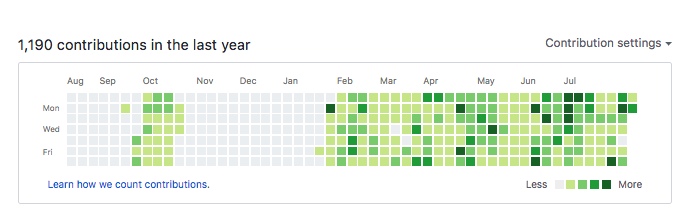

# 200811\_화요일 Today I Learn

## 오늘 배운 것

- Git을 설치하고 Git이 생성된 배경과 장점에 대해 배웠다. Github와 연동해 새로운 repo를 생성했다.

  - 간단한 명령어 정리
    | 값 | 설명 | 약자 |
    ---|:---:|---:
    `ls` | 현재 디렉토리 파일 리스트 |
    `cd` | 폴더 이동 |
    `mkdir` | 폴더만들기 | make directory
    `touch` | 파일만들기 |
    `mv` | 이동 | move
    `rm` | 지우기 | remove
    `rm -r`| 내부 파일까지 지우기 | recursive
    `rm -rf` | 강제로 내부 파일까지 지우기 | recursive force
    `chmod` | 파일 변경 | change modification
    `shift + ;` | 메뉴 바 열기 | `:w` 저장   `:wq` 저장하고 나가기
    `cat + 파일` | 들어가지 않고 파일내용 확인
    `hexo server` | 로컬 서버 구동 | `http://localhost:4000/`
    `hexo generate` | 정적인 파일 생성
    `hexo deploy` | github에 배포

* Hexo를 통해 github와 연결된 블로그를 만들고 첫번째 TIL(Today I Learn) 포스팅을 과제로 만들었다.
  - hexo: Markdown 문법을 지원하는 정적인 블로그 프레임워크
    - hexo의 장점
      1. 명령어 한 줄로 Github 등과 같은 다양한 서버에 배포 가능
      2. 저장소를 clone받아 어디서든 포스팅 작성 & 배포 가능
      3. git으로 버전관리 가능

## 느낀 점

- github desktop을 이용해 혼자 사용할 때보다 더 복잡하고 알아야 할 것이 많았다.
  처음엔 gibhub 블로그를 md를 통해 포스팅(markdown)하는 게 이해가 안갔는데 매니저님이 설명을 해주셔서 이해가 잘 되었다.
- 매일 느낀 점 정리하는 것의 중요성 -
  잔디밭깔기 (요즘은 잔디밭만이 아니라 내용도 중요)
  - 쪼의 블로그 정리
  - fastcampus 선배수강생 [wayhome25님 github블로그](https://wayhome25.github.io/)
    
