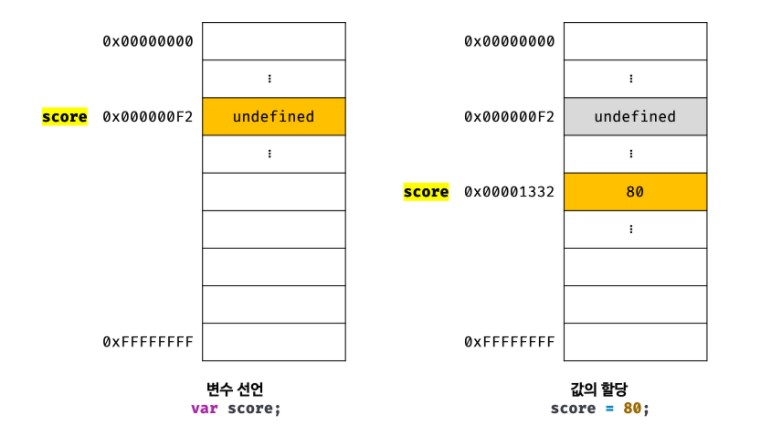

> #변수 선언 #값의 할당 #값의 재할당 #변수 호이스팅

    💡**변수(variable)**
        : 하나의 값을 저장하기 위해 확보한 **메모리 공간** 자체 또는 그 메모리 공간

: 값의 위치를 가리키는 상징적인 이름

## 변수 선언

- var / let / const

  var 키워드로 선언한 변수는 어떠한 값도 할당하지 않아도 `undefined`라는 값을 갖는다.

  - `undefined` : javascript에서 제공하는 원시 타입의 값(primitive value) ,
    변경 불가능한 값임

## 값의 할당

```jsx
var score; // 변수 선언
score = 1; // 값의 할당

var score = 1; // 변수 선언과 값 할당
```



## 값의 재할당

```jsx
var score = 80; // 변수 선언과 값의 할당
score = 90; // 값의 재할당
```

- **const (상수)** : 한 번 정해지면 변하지 않는 값
  ∴ **재할당 불가능**!

## 변수 호이스팅

- 자바스크립트 엔진은 변수 선언이 소스코드의 어디에 있든 상관없이 다른 코드보다 먼저 실행한다. 따라서 변수 선언이 **소스코드의 어디에 위치하는지와 상관없이** 어디서든지 변수를 참조할 수 있다.

```jsx
console.log(score); // undefined
score = 90;
var score;
console.log(score); // 90

//마치 이렇게 출력한 것과 같이 받아들인다.
var score;
console.log(score); // undefined
score = 90;
```

참고로
**변수 선언**은 소스코드가 순차적으로 실행되는 시점인 **런타임 이전에 먼저 실행**
**값의 할당**은 소스코드가 순차적으로 실행되는 시점인 **런타임에 실행**

이처럼 변수 선언문이 코드의 선두로 끌어 올려진 것처럼 동작하는 자바스크립트 고유의 특징을 **변수 호이스팅(variable hoisting)**이라 함.
